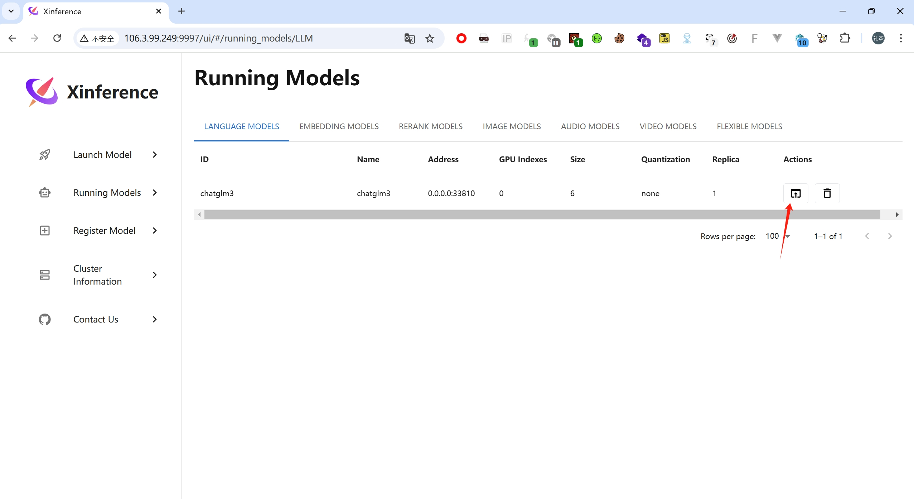
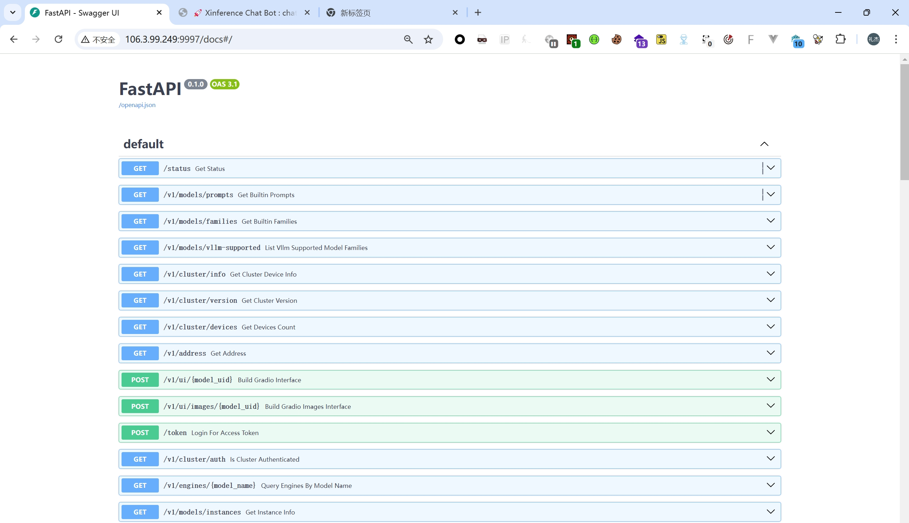
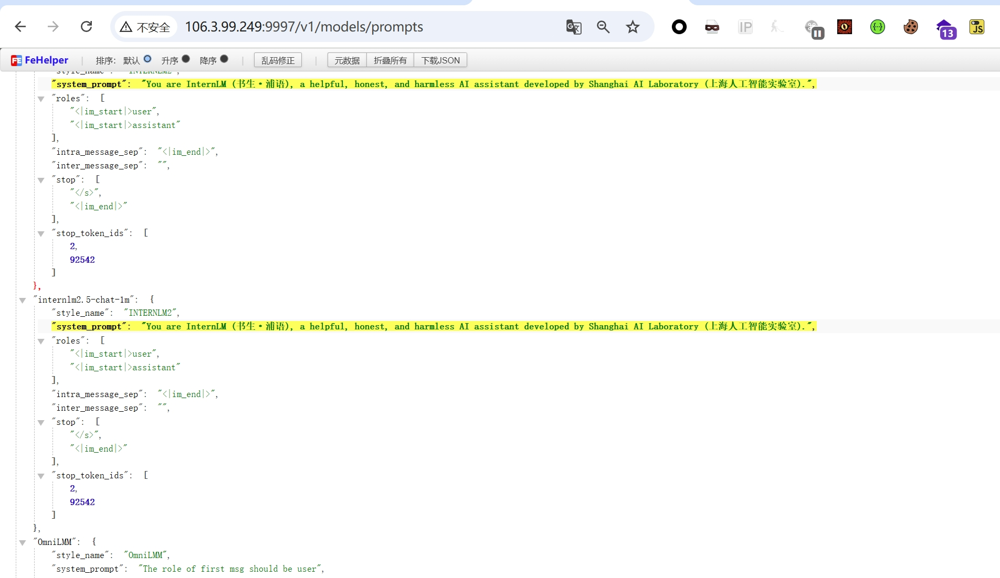
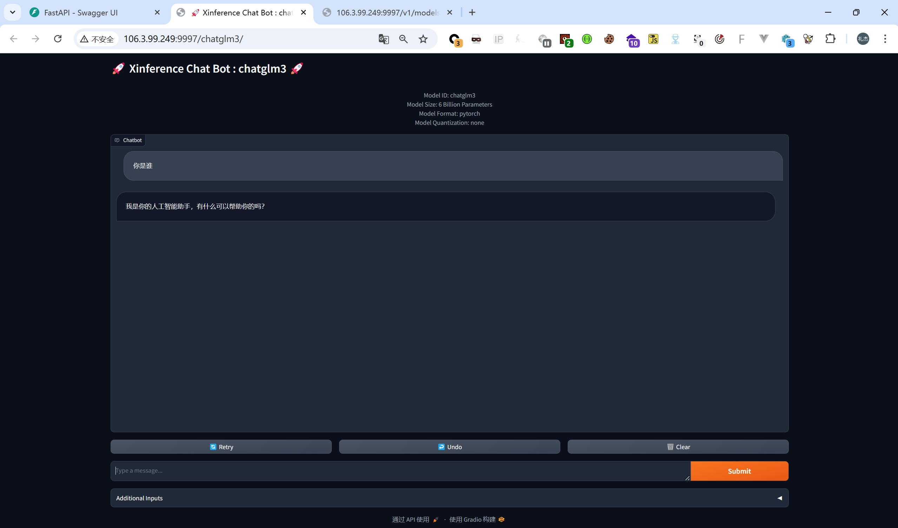

Fingerprint：body="<title>Xinference</title>" 

The Xinference AI large model platform has unauthorized access vulnerabilities, allowing users to access the model at will and directly manipulate the model and its data. Attackers can call model services, obtain model information, and even delete model files or steal data through malicious instructions without authentication.

